<p align="center">
  
</p>

<h1 align="center">CampusOS</h1>
<p align="center"><strong>The AI Operating System for Student Life</strong></p>

<p align="center">
  
  
  
  
  
</p>

<p align="center">
  <em>One AI. One Context. Every dimension of campus life — unified.</em>
</p>

<p align="center">
  <a href="#-quick-start">Quick Start</a> •
  <a href="#-the-problem">The Problem</a> •
  <a href="#-the-vision">The Vision</a> •
  <a href="#-core-modules">Modules</a> •
  <a href="#-architecture">Architecture</a> •
  <a href="#-demo">Demo</a>
</p>

---

## 🎬 Demo

<p align="center">
  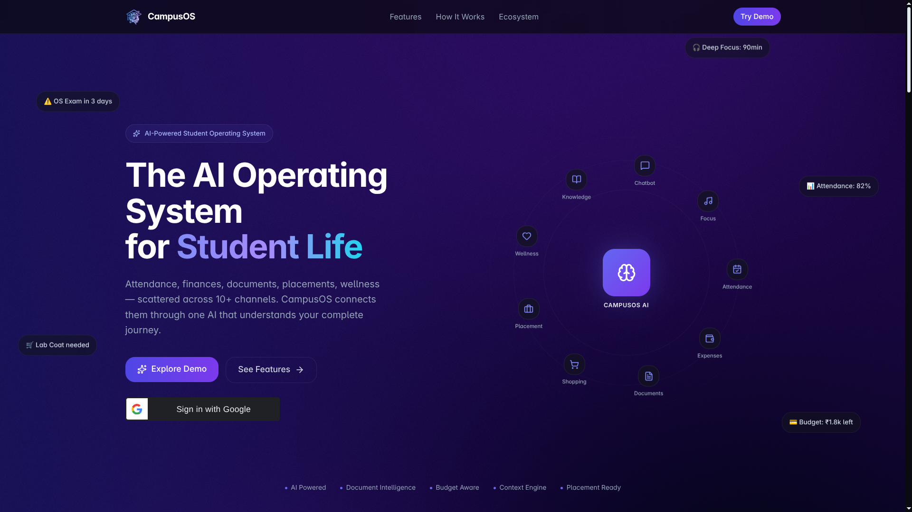
</p>

<p align="center"><em>Premium AI-first landing experience</em></p>

| Dashboard Overview | AI Chatbot | Dark Theme |
|:---------:|:----------:|:---------:|
| 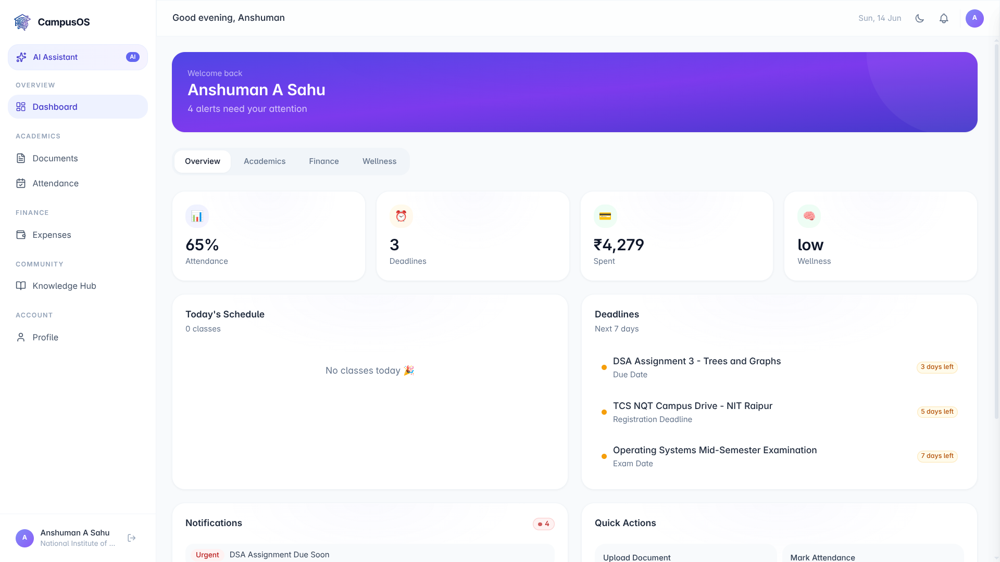 | 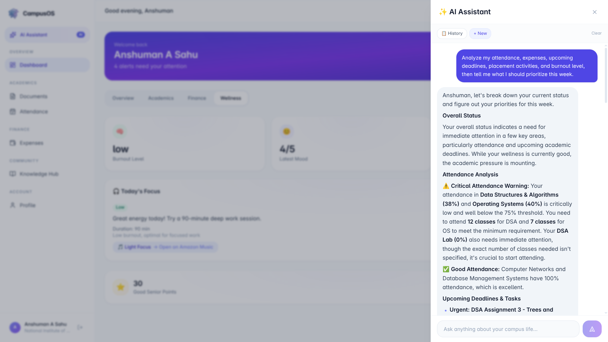 | 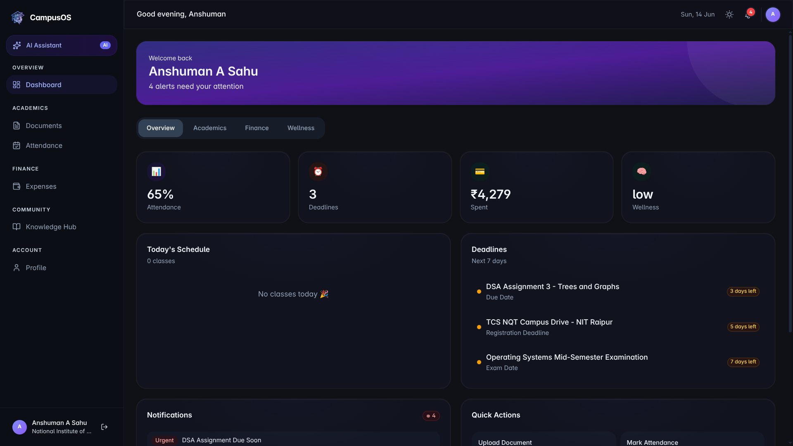 |

---

## 💔 The Problem

A typical engineering student's morning:

> 6:30 AM — Check WhatsApp for class cancellation rumours.  
> 7:00 AM — Scroll through three email threads to find the assignment deadline.  
> 7:15 AM — Open a separate app to check attendance percentage.  
> 7:30 AM — Google "Can I skip today's class safely?"  
> 8:00 AM — Forget to buy the lab coat that's required for tomorrow's practical.  
> 9:00 AM — Miss the placement registration deadline buried in a PDF notice.  
> 10:00 PM — Realize monthly budget is blown. No tracking. No visibility.  
> 11:00 PM — Can't sleep. Stressed. No idea where the semester went.

The problem is not the lack of information. Students are **drowning** in it.

Notices live in PDFs. Deadlines live in emails. Attendance lives in memory. Budgets live in hope. Wellness lives in denial.

**Student life doesn't fail from too little information. It fails from information that never talks to each other.**

<p align="center">
  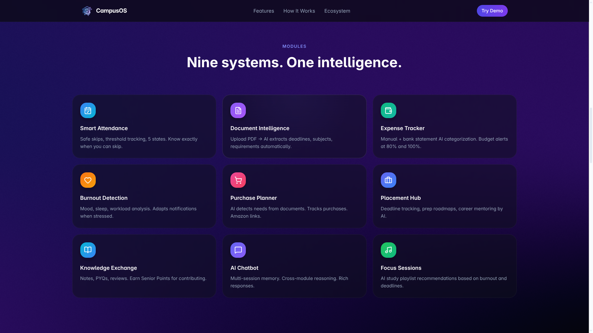
</p>

---

## 🧠 The Vision

**CampusOS is not another student app. It is an AI Operating System.**

Traditional apps solve one problem. CampusOS understands the *student* — their schedule, their finances, their health, their deadlines, their purchases, their career preparation — and reasons across all of them simultaneously.

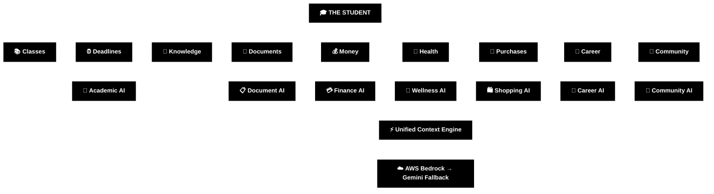

The philosophy:

> **One Upload → AI Extraction → Connected Insights → Multiple Actions**

Upload a syllabus. AI extracts required items. Shopping list updates. Budget adjusts. Notifications generate. Chatbot remembers. Everything connects.

---

## 👥 Who Is This For

| Persona | How CampusOS Helps |
|---------|-------------------|
| **Freshers** | Hostel checklist, semester shopping, timetable setup |
| **Hostellers** | Budget tracking, mess expenses, essential purchases |
| **Placement Aspirants** | Preparation roadmaps, deadline tracking, career guidance |
| **Day Scholars** | Transport tracking, schedule optimization |
| **Club Leaders** | Event document management, notice extraction |
| **Final Year Students** | Knowledge sharing, senior points, mentoring |
| **Stressed Students** | Burnout detection, wellness insights, focus recommendations |

---

## ⚙️ Core Modules

### 📄 AI Document Intelligence

Upload PDF/DOCX → AI extracts structured data → User reviews → Data flows everywhere.

<p align="center">
  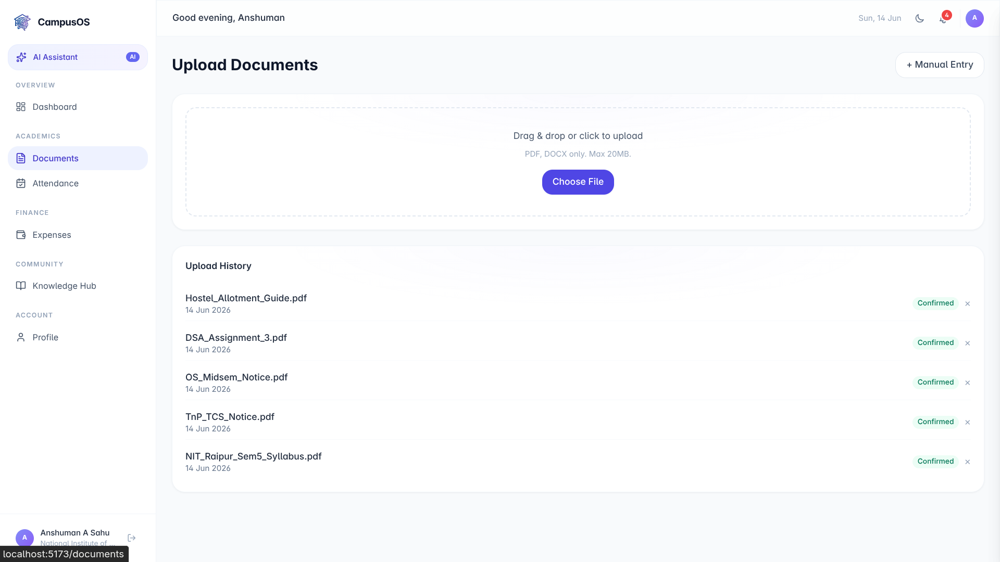
</p>
<p align="center"><em>AI-powered document extraction with review gate</em></p>

11 document categories: Assignment, Exam, Placement, Club Event, Attendance, Scholarship, Hostel Notice, Fee Payment, Transport, Personal Reminder, Other.

---

### 📊 Smart Attendance

Not just marking present/absent. CampusOS calculates:

- **Safe Skips** — How many classes can you miss and still meet the threshold
- **Classes Needed** — Exactly how many you need to attend to recover
- **Per-Subject Analytics** — Individual subject health
- **Threshold Awareness** — User-defined targets per subject

<p align="center">
  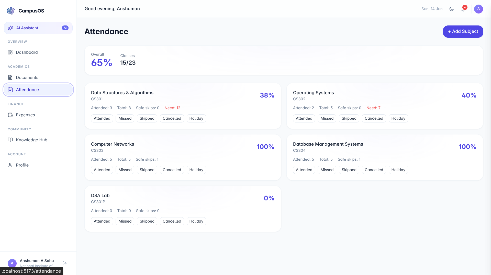
</p>
<p align="center"><em>Smart attendance tracking with safe skip calculations</em></p>

5 states: Attended, Missed, Skipped, Cancelled, Holiday (cancelled/holiday don't affect percentages).

---

### 💳 Expense Intelligence

Manual tracking + AI-powered bank statement categorization.

<p align="center">
  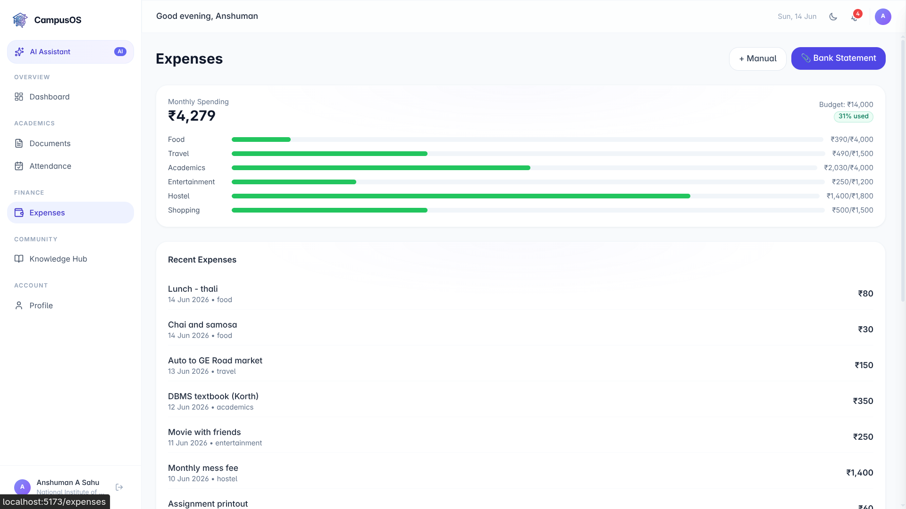
</p>
<p align="center"><em>AI-categorized expenses with budget monitoring</em></p>

- 9 categories: Food, Travel, Academics, Shopping, Entertainment, Hostel, Medical, Bills, Other
- Monthly budgets with threshold alerts (80% warning, 100% critical)
- AI categorizes CSV bank statements → User reviews → Batch confirm

---

### 🧠 Burnout Detection

The wellness module that prevents semester burnout before it happens.

<p align="center">
  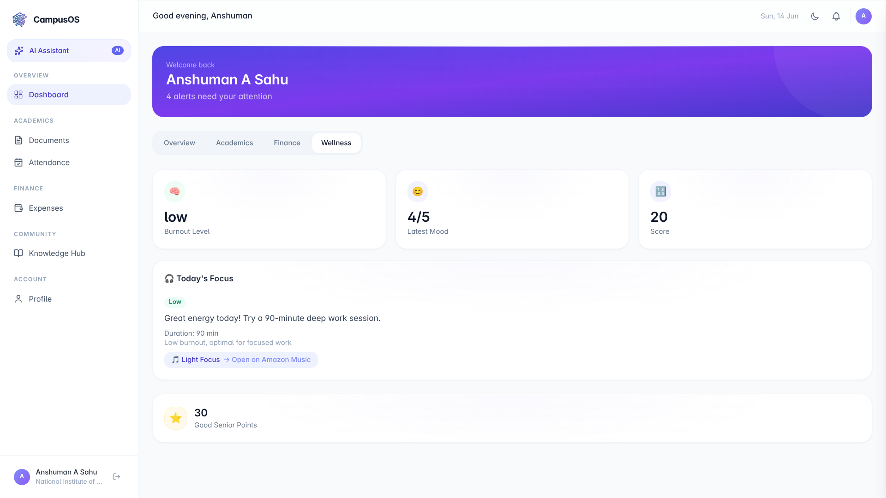
</p>
<p align="center"><em>Burnout detection with adaptive notifications</em></p>

**Output:** Score 0-100 → Low / Medium / High

**Impact:** When burnout is HIGH → notifications are reduced, only urgent alerts surface, financial nudges softened.

---

### 🛒 Amazon Marketplace Integration

AI-powered student purchase planner. Not a shopping app — a needs-awareness system.

- AI detects required purchases from uploaded documents (syllabus, hostel guide)
- Tracks purchased vs. pending items
- Compares shopping cost against remaining budget
- Generates Amazon search links (no API dependency)

---

### ✨ AI Chatbot — The Brain

A ChatGPT-style conversational interface grounded in the student's own data.

<p align="center">
  
  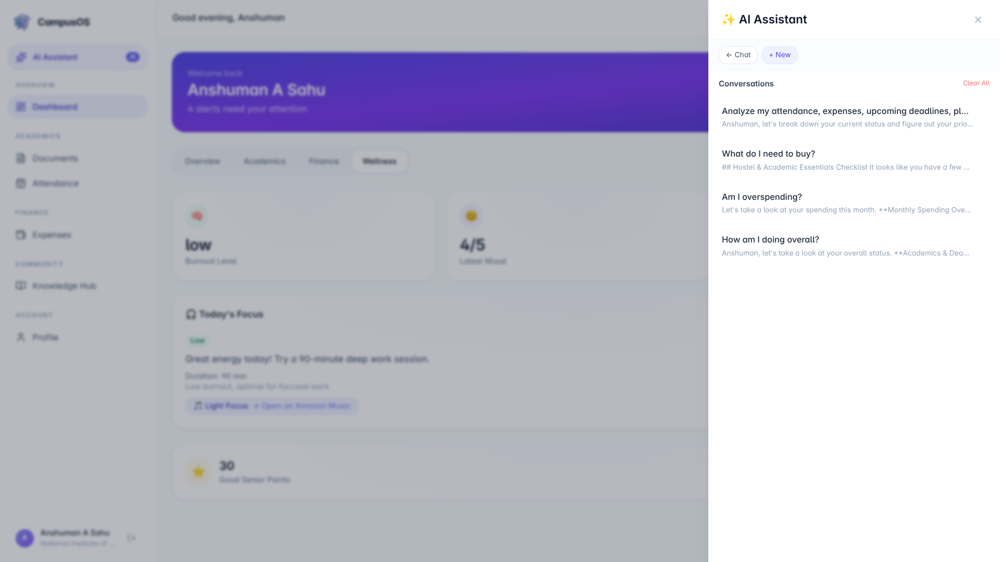
</p>
<p align="center"><em>Multi-session AI chatbot with rich markdown responses</em></p>

**What it knows:** Timetable, Attendance, Expenses, Budgets, Documents, Deadlines, Shopping, Wellness, Notifications, Profile, Knowledge Hub.

**What it refuses:** Coding solutions, world news, general trivia, anything unrelated to campus life.

---

### 📚 Knowledge Exchange

Community-driven academic resource sharing.

<p align="center">
  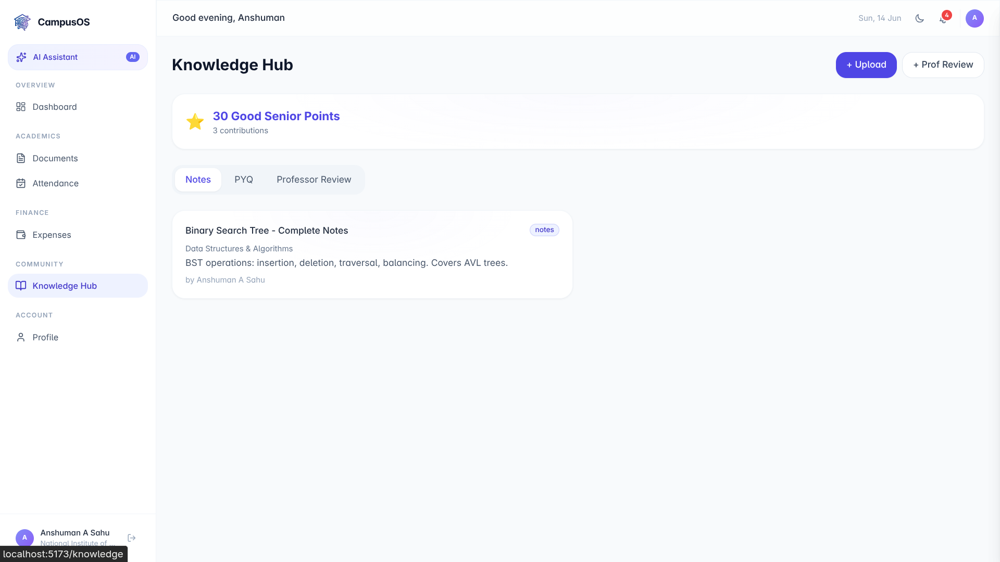
</p>
<p align="center"><em>Notes, PYQs, and professor reviews with Senior Points</em></p>

- Good Senior Points reward system (Notes: +10, PYQ: +15, Review: +5)
- Shared read, owner-only write
- Searchable by subject and type

---

### 🔔 Intelligent Notifications

<p align="center">
  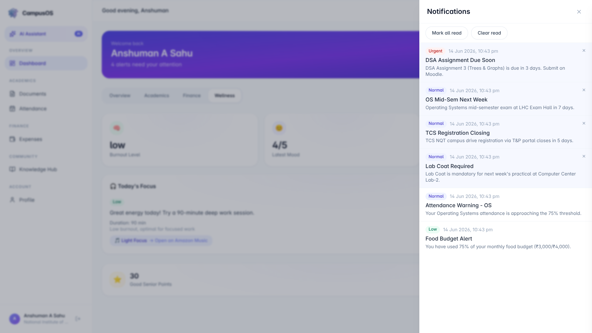
</p>
<p align="center"><em>Priority-aware, burnout-sensitive alerts</em></p>

---

### 👤 Profile & Analytics

<p align="center">
  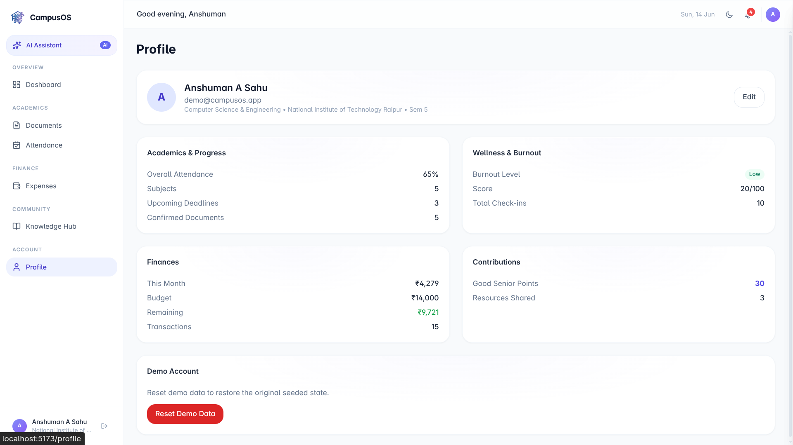
</p>
<p align="center"><em>Complete student overview with academic and financial summaries</em></p>

---

## 🔄 How the AI Works

CampusOS doesn't use AI in isolation. It uses **contextual intelligence** — combining data from multiple modules in every AI interaction.

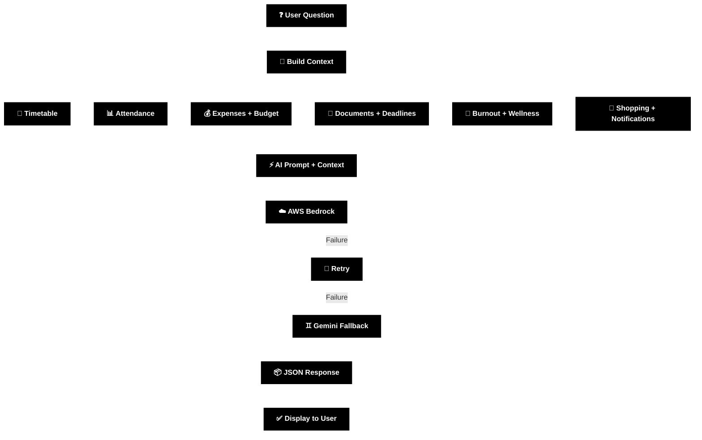

**Why isolated apps can't do this:**

| Question | Traditional Apps | CampusOS |
|----------|-----------------|----------|
| "Can I skip class?" | Check attendance app | Combines: attendance %, threshold, upcoming exams, burnout level |
| "Am I overspending?" | Check budget app | Combines: spending trend, pending shopping, upcoming semester needs |
| "How should I prepare?" | Generic study tips | Combines: your subjects, deadlines, attendance gaps, placement timeline |

---

## 🚀 User Journeys

<details>
<summary><strong>Journey 1: The Freshman Setup</strong></summary>

```
Day 1: Login → Upload Hostel Guide PDF
    ↓ AI extracts: pillow, extension board, study lamp, bucket
    ↓ Shopping list created automatically
    ↓ Budget comparison: "You can afford ₹3,500 of essentials"
    ↓ Amazon links generated for each item

Day 2: Upload Semester Syllabus
    ↓ AI extracts: Scientific Calculator, Lab Coat, DBMS Textbook
    ↓ Shopping list updates (new items + priorities)
    ↓ "Lab Coat is mandatory for next week's practical" → Urgent

Day 7: Mark attendance daily
    ↓ Safe skips calculated per subject

Day 14: Burnout check-in
    ↓ Score: 45 (Medium)
    ↓ Focus recommendation: "Light Focus playlist, 60 minutes"
```
</details>

<details>
<summary><strong>Journey 2: Placement Season</strong></summary>

```
Upload TCS Placement Notice
    ↓ AI extracts: Registration deadline (5 days), eligibility criteria
    ↓ Urgent notification created

Ask chatbot: "How should I prepare for placements?"
    ↓ Returns: personalized week-by-week preparation plan
    ↓ Recommends: Coding Focus playlist

Ask: "Can I afford a DSA textbook?"
    ↓ Response: "Yes, ₹900 book fits within your ₹3,350 remaining"
    ↓ Amazon link: Database System Concepts (Korth)
```
</details>

---

## 📊 Impact

| Metric | Before CampusOS | With CampusOS |
|--------|----------------|---------------|
| Missed deadlines | Frequent | AI-detected from PDFs |
| Attendance tracking | Mental math | Automated with safe skips |
| Budget visibility | None | Real-time with alerts |
| Burnout detection | After collapse | Early warning system |
| Purchase planning | Reactive | Proactive AI detection |
| Placement preparation | Unstructured | Mentored roadmaps |
| Knowledge sharing | WhatsApp chaos | Structured + rewarded |

---

## 🏗️ Architecture

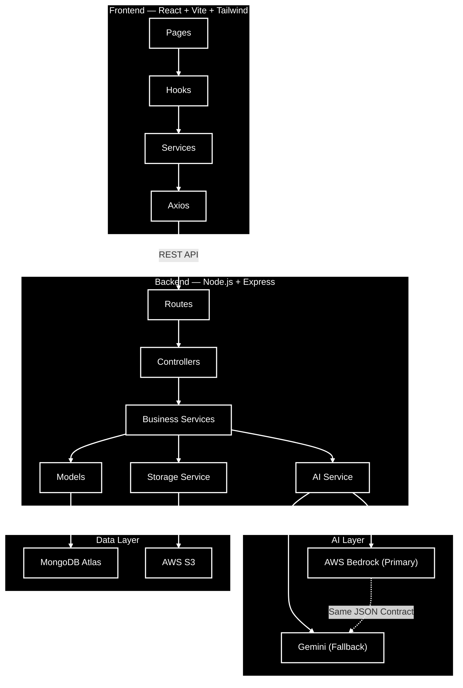

### Key Architecture Decisions

| Decision | Rationale |
|----------|-----------|
| Monolithic | Hackathon-speed + simplicity |
| Bedrock → Gemini fallback | Reliability without complexity |
| Review gate on all AI saves | User trust + data accuracy |
| userId on every query | Zero cross-user data leaks |
| Promise.allSettled in dashboard | Partial failure tolerance |
| Session-based chat | Conversational memory |

---

## 🛠️ Tech Stack

| Layer | Technology | Why |
|-------|-----------|-----|
| Frontend | React 18, Vite, Tailwind CSS | Fast, modern, hackathon-friendly |
| Backend | Node.js, Express.js | JavaScript everywhere, rapid development |
| Database | MongoDB Atlas | Flexible schema, free tier, Atlas search |
| AI Primary | AWS Bedrock (Claude) | Enterprise-grade, low latency |
| AI Fallback | Google Gemini | Reliability guarantee |
| Storage | AWS S3 | Scalable file storage |
| Auth | Google OAuth + JWT | Minimal friction |
| Deploy | AWS (Frontend + Backend) | Full-stack cloud deployment |

---

## 📁 Project Structure

```
CampusOS/
├── frontend/
│   └── src/
│       ├── components/      # Shared + Layout UI
│       ├── pages/           # Route-level views
│       ├── hooks/           # Custom React hooks (10)
│       ├── services/        # API service layer (12)
│       ├── context/         # Auth + Notifications
│       ├── config/          # Axios instance
│       └── utils/           # Formatters, calculators, constants
├── backend/
│   └── src/
│       ├── routes/          # Express routes (12 modules)
│       ├── controllers/     # Request handlers
│       ├── services/        # Business logic (14 services)
│       ├── models/          # Mongoose schemas (13 collections)
│       ├── middleware/      # Auth, rate-limit, upload, errors
│       ├── ai/             # Bedrock, Gemini, 4 prompt templates
│       ├── config/          # ENV, DB, S3
│       └── utils/           # Validators, date, attendance, budget
├── seed/                    # Demo data (comprehensive)
└── docs/                    # LLD, architecture docs
```

---

## 🚀 Quick Start

### Prerequisites
- Node.js 18+
- MongoDB Atlas account (free tier works)
- AWS account (S3 + Bedrock) or Gemini API key

### Installation

```bash
git clone https://github.com/your-username/CampusOS.git
cd CampusOS

# Backend
cd backend
cp .env.example .env    # Fill environment variables
npm install
npm run seed            # Load demo data
npm run dev             # Starts on :5000

# Frontend (new terminal)
cd frontend
cp .env.example .env    # Set VITE_GOOGLE_CLIENT_ID
npm install
npm run dev             # Starts on :5173
```

### Environment Variables

<details>
<summary>Backend .env</summary>

```
PORT=5000
NODE_ENV=development
MONGODB_URI=mongodb+srv://...
GOOGLE_CLIENT_ID=...
GOOGLE_CLIENT_SECRET=...
SESSION_SECRET=min-32-characters
AWS_ACCESS_KEY=...
AWS_SECRET_KEY=...
AWS_REGION=us-east-1
AWS_BEDROCK_MODEL=anthropic.claude-3-haiku-20240307-v1:0
S3_BUCKET_NAME=campusos-uploads
GEMINI_API_KEY=...
FRONTEND_URL=http://localhost:5173
```
</details>

### Demo Login
Click **"Try Demo"** on the landing page. Pre-loaded with:
- 10 timetable entries across 4 subjects
- 23 attendance records (all 5 states)
- 16 expenses with budget tracking
- 5 documents (syllabus, exams, placement)
- 7 shopping items (2 purchased, 5 pending)
- 10 burnout records showing stress trend
- 6 notifications at different priorities
- Knowledge resources with senior points

---

## 🎨 Design System

- **Philosophy:** Linear/Vercel-inspired, AI-first, student-friendly
- **Dark Mode:** Full support with layered surfaces (no harsh blacks)
- **Typography:** Inter with 6-level hierarchy (display → micro)
- **Colors:** Brand (Indigo-Violet), Status (Emerald/Amber/Red), Surfaces (layered grays)
- **Animations:** Fade-up stagger, spring interactions, shimmer skeletons
- **Accessibility:** Focus rings, keyboard navigation, proper contrast, ARIA labels

<p align="center">
  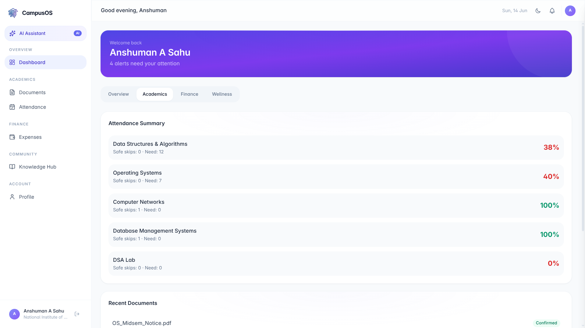
  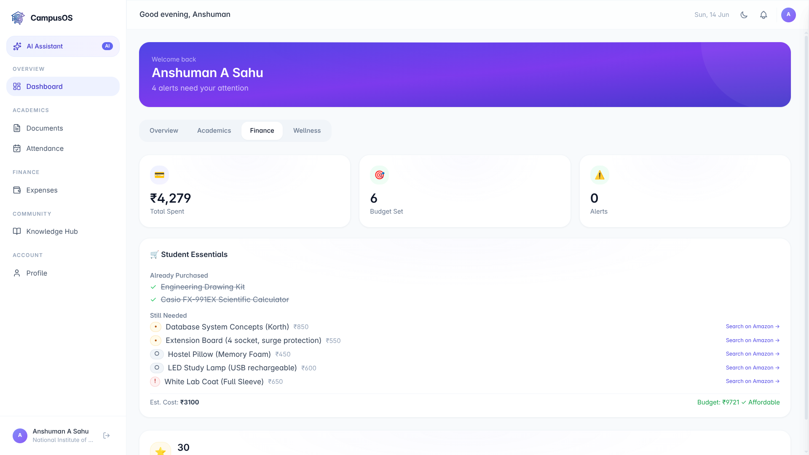
</p>
<p align="center"><em>Dashboard tabs: Academics and Finance views</em></p>

---

## 🔐 Security

- JWT authentication (24h expiry)
- Every database query scoped by `userId`
- AI cannot access other users' data
- AI cannot auto-save (review gate mandatory)
- S3 objects private (signed URLs for access)
- Rate limiting: API (100/15m), Auth (20/15m), AI (30/15m)
- File validation: PDF/DOCX/CSV/TXT only, 20MB max, no images

---

## 📈 Scalability Roadmap

- [ ] Multi-college support with institution codes
- [ ] University admin dashboards
- [ ] Amazon Product API integration (real-time prices)
- [ ] Amazon Music SDK (embedded player)
- [ ] Mobile app (React Native)
- [ ] Agentic AI (auto-mark attendance from location)
- [ ] Campus community feed
- [ ] Recommendation engine (collaborative filtering)
- [ ] Analytics dashboard for students
- [ ] LMS integrations (Moodle, Canvas)

---

## 🏆 Why This Project Is Different

| Traditional Student Apps | CampusOS |
|--------------------------|----------|
| One feature, one purpose | Connected ecosystem |
| Static data display | AI-powered reasoning |
| No cross-feature context | Unified intelligence layer |
| Generic advice | Personalized to YOUR data |
| Information in silos | Information that talks |
| Reactive (after failure) | Proactive (before failure) |

CampusOS is not 10 apps stitched together. It is **one AI brain** that understands the complete student lifecycle.

---

## 💡 Innovation Summary

1. **Cross-module AI reasoning** — Not isolated features, but connected intelligence
2. **Document-to-action pipeline** — Upload PDF → Shopping list + Budget + Notifications
3. **Burnout-aware notifications** — System adapts to human state
4. **Amazon ecosystem integration** — Marketplace + Music as student life tools
5. **Session-based conversational memory** — ChatGPT-style UX with campus context
6. **Review gate architecture** — AI assists but never decides alone
7. **Deterministic-first AI** — Parse before predict, validate before save

---

## 👨‍💻 Authors

| Name | Role |
|------|------|
| **Amit** | Full Stack Development & Architecture |
| **Anshuman** | AI Systems & Backend Engineering |
| **Surabhi** | Frontend Development & UI/UX Design |

---

## 🤝 Contributing

1. Fork the repository
2. Create your feature branch: `git checkout -b feature/amazing-feature`
3. Follow existing code style (kebab-case files, Controller-Service-Model pattern)
4. Ensure `npm run build` passes for both frontend and backend
5. Submit a pull request

---

## 🌍 The Bigger Picture

Universities manage thousands of students who are individually overwhelmed but collectively predictable. A student who misses three consecutive classes, overspends in week two, sleeps less than five hours, and has an exam in three days — that student needs intervention.

CampusOS is the foundation for that intervention layer.

Today it's a personal assistant. Tomorrow it's an institutional intelligence platform that helps universities understand, support, and retain their students — not through surveillance, but through empowerment.

**The goal is not to build another productivity app.**

**The goal is to make student life *legible* — to the student themselves.**

When a student can finally see their entire campus life in one place, understood by one AI, connected across every dimension — they stop surviving semesters and start owning them.

---

<p align="center">
  <strong>CampusOS</strong> — Because student life deserves an operating system.
</p>

<p align="center">
  Built with ❤️ by <strong>Amit</strong>, <strong>Anshuman</strong>, and <strong>Surabhi</strong>
</p>
